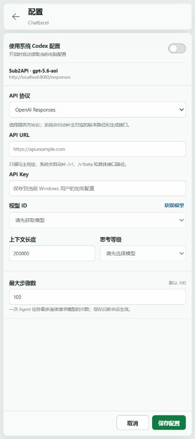

# ChatExcel 中文说明

<div align="center">

[](https://github.com/aEboli/ChatExcel/releases/tag/v0.0.3)
[](https://nodejs.org/)
[](https://www.microsoft.com/microsoft-365/excel)
[](https://github.com/aEboli/ChatExcel/releases)
[](README.md)

**本地优先的 Microsoft Excel AI 工作簿 Agent**

不离开 Excel，读取当前工作表、理解工作簿上下文、粘贴参考图片，并在明确边界内完成可审计的修改。

当前发行版：`v0.0.3` · 源码、Windows 启动器和 Release 资产保持同一版本

</div>

> 这份中文 README 是项目的详细使用说明；英文概览见 [README.md](README.md)。

## v0.0.3 更新

- **剪贴板图片输入：** 聚焦任务输入框时可粘贴 PNG、JPEG 或 WebP，查看固定尺寸缩略图、删除附件，或打开支持键盘关闭和焦点返回的完整预览；只发送图片、不填写文字也可以开始任务。
- **图片会话不持久化：** 图片复用现有多模态协议适配器，只保存在当前页面内存中。含图片的会话会跳过磁盘恢复，图片不会进入加密恢复快照。
- **能力安全的模型控制：** 精确匹配官方目录的模型使用已验证上下文长度和思考能力；未知 OpenAI 兼容模型默认使用“自动”，兼容候选与已证实能力分开呈现。
- **协议专属思考参数：** 保留 Qwen 思考开关、DeepSeek V4 推理模式和 OpenAI 思考等级；切换模型或刷新目录后会自动纠正失效选择。
- **更严格的工作簿修改：** 范围型修改先做 `5,000` 个单元格影响保护，成功后返回 `impact` 和读回的 `verification` 摘要。
- **更紧凑的任务窗格：** 在 400px 和 320px 宽度下收紧固定区域，为对话和工作簿结果保留更多空间；正文保持 12px/17px，桌面端常用命中区域不小于 24px，并保留焦点和 reduced-motion 行为。

本发行版将以上已验证的 `main` 改动同步到 GitHub 和 Windows x64 启动器。

## 项目概述

ChatExcel 把一个受控的工具型 Agent 放到当前工作簿旁边。它可以读取范围、写入值和公式、调整格式、创建表格或图表、排序数据，并通过流式对话反馈每一步结果。读取操作可自动执行；写入、格式和结构变化要么逐项等待审批，要么在界面明确选择“无需审批”后执行。

| 领域 | 当前能力 |
| --- | --- |
| 工作簿工具 | 读取、值、公式、格式、数字格式、自动调整、清除、工作表、表格、图表、排序 |
| Agent 循环 | 流式文字、完整工具参数校验、结构化错误、自动纠错，步骤上限 1 到 1000 |
| 提供方 | 系统 WorkBuddy 配置，或自定义 OpenAI Responses、Chat Completions、Anthropic Messages、Gemini 接口 |
| 图片输入 | 最多 4 张 PNG/JPEG/WebP；缩略图、删除、放大、图片-only 发送和协议转换 |
| 操作记录 | 可折叠任务级记录、只读可视化步骤预览、继续历史上下文前的确认 |
| 崩溃恢复 | 当前工作簿一个 DPAPI 加密会话；含图片的会话明确排除 |
| 分发方式 | 源码开发流程，以及面向桌面 Excel 的 Windows x64 自包含启动器 |

## 真实界面预览

<p align="center">
  
  
</p>

任务窗格将工作簿身份、对话、操作记录、模型/思考控制、审批模式和发送/停止控件放在同一条工作流中；底部还包含一个本地资源构成的小彩蛋，并尊重 `prefers-reduced-motion`。

## 工作原理

```text
Microsoft Excel 任务窗格（Office.js）
              │ 同源 HTTPS
              ▼
       127.0.0.1:3210 本地伴随服务
              │ 配置 + 会话循环 + 协议适配
              ▼
   WorkBuddy 提供方 / 自定义 API / 本地网关
```

- Office.js 或原生 `.xls` 伴随窗格只执行已注册的工作簿工具。
- 本地 Node.js 服务负责保护凭据、发现模型、转换统一 Agent 循环并把事件流回任务窗格。
- 文字、兼容图片输入、工具调用、工具结果、thinking block 和用量信息会按协议转换。
- 工具参数完整后才校验，之后才触碰 Excel；未知工具、无效参数、超大范围、未审批和只读工作簿都会安全失败。

## 支持的协议

配置页填写 API 主地址即可，例如 `https://api.openai.com`。粘贴 `/v1`、`/v1beta` 或已知方法后缀时会自动规范化，同时保留网关自己的路径前缀。

| 协议 | 生成端点 | 模型发现 | 流式输出 |
| --- | --- | --- | --- |
| OpenAI Responses | `/v1/responses` | `/v1/models` | SSE + JSON 回退 |
| OpenAI Chat Completions | `/v1/chat/completions` | `/v1/models` | SSE + JSON 回退 |
| Anthropic Messages | `/v1/messages` | `/v1/models` | SSE + JSON 回退 |
| Google Gemini | `/v1beta/models/{model}:generateContent` | `/v1beta/models` | `:streamGenerateContent?alt=sse` + JSON 回退 |

不同提供方和兼容网关的模型目录、图片和思考参数可能不同。模型发现成功或连接测试通过，不等于所有思考值、图片输入和工具流程都一定被上游接受。

## 快速开始

### Windows 打包启动器（普通用户）

1. 从 [GitHub Releases](https://github.com/aEboli/ChatExcel/releases/tag/v0.0.3) 下载 `ChatExcel-Launcher-0.0.3-win-x64.zip`。
2. 需要时先用旁边的 `.sha256` 文件校验，再完整解压整个目录。
3. 双击 `ChatExcel Launcher.exe`。
4. 在 Excel 的 `ChatEx` 功能区组点击 `Open ChatExcel`。

发行包内置 Node.js 运行时和启动器依赖；目标电脑仍需 Windows 10/11、Microsoft Excel 2019 或 Microsoft 365 桌面版。WPS 不支持；已有 `.xls` 工作簿还需要 WebView2。

### 源码开发

```powershell
git clone https://github.com/aEboli/ChatExcel.git
cd ChatExcel
npm install
npm run icons
npm run certs:install
npm run certs:verify
npm run validate:manifest
npm run start:local
npm run sideload
```

本地伴随服务只监听 `https://localhost:3210`。停止本项目服务和恢复守护器：

```powershell
npm run stop:local
```

## 工作簿格式

| 格式 | 执行路径 | 格式处理 |
| --- | --- | --- |
| `.xlsx`、`.xlsm`、`.xlsb` | Office.js 任务窗格 | 使用已经打开的工作簿 |
| `.xls` | 内置原生 Excel 伴随窗格 | 打开原始绝对路径，不静默转换，也不会自行创建 OOXML 副本 |

兼容模式不支持的操作会返回明确工具错误。ChatExcel 不绕过工作表保护、宏、VBA、Power Query 或透视表安全边界。

## 配置说明

ChatExcel 可以在每个模型步骤读取当前用户的 WorkBuddy 提供方：

```toml
model_provider = "local"
model = "your-model"
model_reasoning_effort = "high"

[model_providers.local]
name = "Local Provider"
base_url = "http://localhost:8080"
wire_api = "responses"
env_key = "LOCAL_MODEL_TOKEN"
```

如果使用自定义提供方，在设置页关闭“使用系统 WorkBuddy 配置”，选择协议，填写 API 主地址和密钥，获取模型，再选择上下文长度、思考等级和最大步骤数。非密钥设置保存在 `%APPDATA%\ChatExcel\settings.json`；API Key 使用当前 Windows 用户 DPAPI 加密，明文只在本地服务进程运行期间存在。

## 图片输入与恢复边界

- 聚焦输入框后直接粘贴图片；实现同时读取 `clipboardData.files` 和 `DataTransferItem.getAsFile()`，兼容 Excel WebView 的两种剪贴板形态。
- 只接受 PNG、JPEG、WebP；单条消息最多 4 张，单图和总大小由前端压缩与服务端校验共同限制。
- 图片缩略图可删除，点击后打开可放大的预览；支持关闭按钮、Esc、背景点击和返回原焦点。
- 图片通过既有 `attachments` 字段发送，由服务端规范化为 `input_image` 后转为各协议的图片内容，不新增前端直连上游路径。
- 图片附件只存在页面内存，不进入设置、日志、工作簿或 `%LOCALAPPDATA%\ChatExcel\conversation-recovery.json`。含图片会话仍可继续，但磁盘 checkpoint 会跳过或清除，并显示“恢复不可用”。

## 隐私与安全

- 服务只绑定 `127.0.0.1`，并校验请求 `Host` 和 `Origin`。
- API Key 不会返回到任务窗格；提供方错误统一经过凭据脱敏。
- 请求正文、提示词、工作簿数据、工具结果和图片附件不会写入日志。
- 纯文本会话在当前工作簿有稳定标识时，才可能写入 `%LOCALAPPDATA%\ChatExcel\conversation-recovery.json`；该文件按当前 Windows 用户 DPAPI 加密、按工作簿隔离，并在最后一次成功任务窗格心跳后 30 分钟过期，或在停止、重置和明确清空时删除。
- 历史步骤预览是前端只读可视化，不执行回滚、不保存工作簿快照，也不会自动重发模型请求。

## 项目结构

```text
ChatExcel/
|-- assets/                  # 图标、本地界面资源和截图
|-- docs/                    # 验证说明
|-- launcher/                # .NET Windows 启动器
|-- openspec/                # 当前规格与已归档变更
|-- scripts/                 # 证书、生命周期、侧载、构建和打包脚本
|-- src/server/              # 本地 HTTPS 服务、会话、恢复和协议适配
|-- src/shared/              # Excel 工具 schema 与应用元数据
|-- src/taskpane/            # Office 任务窗格界面和 Excel 执行器
|-- tests/                   # Node 测试与原生 Excel smoke 工程
|-- manifest.xml             # Office 加载项清单
|-- package-lock.json
`-- package.json
```

## 开发与验证

```powershell
npm run check
npm test
npm run validate:manifest
npm audit --omit=dev
npm run check:launcher
dotnet build tests/native-smoke/ChatExcel.NativeSmoke.csproj --configuration Release
openspec validate --all --strict
git diff --check
```

`npm run build:launcher` 会创建便携启动器目录；`npm run diagnose:launcher` 只做发行目录检查，不启动服务。桌面 Excel 中的长时间流式停止、实时工作簿修改和原生 `.xls` 兼容性仍需在目标主机做人工验收。

## 当前限制

- 必须使用桌面版 Microsoft Excel；当前不支持 WPS、Excel Online 或 macOS。
- 当前发行版面向 Windows x64，侧载源码流程需要受信任的 Office 本地开发证书。
- 未知提供方模型在拿到明确元数据前使用保守的“自动”思考模式。
- 图片功能取决于所选模型或网关是否支持兼容的多模态输入。
- Marketplace 发布、多用户云服务、宏、VBA、Power Query、透视表自动化、工作簿快照和破坏性回滚不在当前范围。

## 版本、更新日志与许可证

- 最新打包发行版：[ChatExcel v0.0.3](https://github.com/aEboli/ChatExcel/releases/tag/v0.0.3)
- 更新日志：[CHANGELOG.zh-CN.md](CHANGELOG.zh-CN.md)
- English overview：[README.md](README.md)
- 当前尚未选择许可证；在组织外分发前请补充许可证文件。
